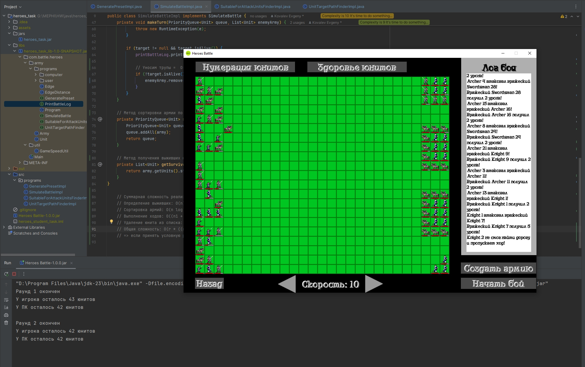

#### Ковалёв Евгений. 
#### Учебный проект по курсу "Алгоритмы и структуры данных". МИФИ, магистратура ИИКС, 1 курс

-------------

# Итоговый проект "Разработка стратегии в стиле боя в игре "Герои Меча и Магии 3" против искусственного интеллекта"

## Добро пожаловать в итоговый проект!

Мы прошли невероятный путь, и теперь пришло время применить полученные знания в самой главной практической работе курса. Нам предстоит имплементировать 4 алгоритма (метода) в проекте, которые определяют ключевую игровую механику: генерацию армии, симуляцию боя, выбор подходящих для атаки юнитов и нахождение кратчайшего пути между атакующим и целью.

### Дано

В проекте библиотеки игры `heroes_task_lib` определено четыре интерфейса, методы которых нам предстоит имплементировать в проекте `heroes_task` согласно документации. Это интерфейсы `GeneratePreset`, `SimulateBattle`, `SuitableForAttackUnitsFinder` и `UnitTargetPathFinder`.

### Задача
Необходимо реализовать все четыре метода в проекте `heroes_task`.

### Решение

- [Исходники с реализацией интерфейсов](./src/programs)

- [Собранный JAR-файл для запуска приложения проекта](./jars/heroes_task.jar)

- Описание реализации интерфейсов сделано непосредственно в исходном коде

- Расчет суммарной алгоритмической сложности приведен в конце каждого из файлов

### Скриншот реализованного геймплея

